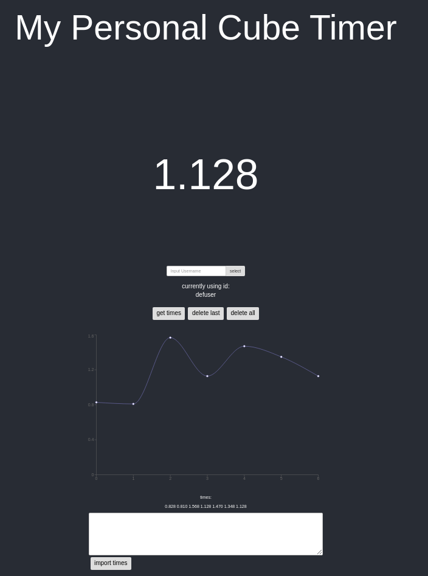

# Rubik-s-Timer

This timer is already old, outdated, and shouldn't even be looked at. A newer version of the app can be fonud [here](https://cube-timer-client.herokuapp.com/) and the code for it has been split up into two repositories. The client can be found [here](https://github.com/vdoubleu/cube-timer2-client) and the server can be found [here](https://github.com/vdoubleu/cube-timer2-server).

This is an improved version of my original [slap together timer](https://github.com/vdoubleu/slap-together-timer) and thus follows much the same philosophy. I wanted a simple Rubik's Cube timer that had a few features that I could not find anywhere else (without having to pay money). Most notably: start and stop using the spacebar, records solve times between sessions, graphing of the times, and multiple profiles for different cube types. I maintained all of these same functionalities from the original timer while keeping a simple and clean look. Some features such as line of best fit have not been brought over yet but there are plans to do so in the future.

The front-end is made using ReactJS with some help from Bootstrap. Ajax was used to make API calls to a Flask server that takes and records times to a Mongo database. Graphing was done using Recharts and should update dynamically.

To run, you simply need to run the command `npm run dev` inside the client directory to start everything in developement mode. You can also use docker-compose to run everything however you will need to make sure you have cors disabled for it to function. If you use docker-compose, by default the the project runs on localhost:5001. If you use `npm run dev` to start it, the app runs on localhost:3000.

Start and stop the timer with spacebar. (The timer is setup in competition format, so be sure to hold it down until it turns green  before you start)

You can have different users/profiles and have different times associated with each one. To change, simply type in the name of the name you wish to swap to. By default, it is set to `defuser`. (default user)

You can import existing times by simply pasting the batch in the text box in bottom. Imported times should be in CSV format.

